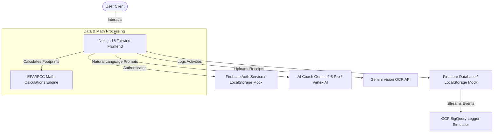

# CarbonOS AI - Sustainable Intelligence Platform

CarbonOS AI is a production-grade, AI-powered carbon footprint optimizer designed to help users track, simulate, forecast, and reduce their lifestyle greenhouse gas emissions.

💻 **Live Deployed App**: [https://carbonos-ai-160715832584.us-central1.run.app/](https://carbonos-ai-160715832584.us-central1.run.app/)  
📁 **Public Codebase**: [Manas51240/CarbonOS-AI](https://github.com/Manas51240/CarbonOS-AI)

---

## 1. Problem Statement & Mission
Global warming and climate change are driven by rising greenhouse gas emissions. While collective action is crucial, individual lifestyle choices (commutes, diet, household heating, digital consumption) compound to represent a significant share of global emissions. However, existing footprint calculators are static, tedious, and fail to provide actionable context-based advice.

**CarbonOS AI** solves this by establishing a dynamic, game-centered, and AI-driven sustainability console. By maintaining a **Digital Carbon Twin** representing the user's active choices, and syncing it with a context-aware **AI Coach (Gemini 2.5 Pro)** and a **Vision-enabled Receipt Scanner**, CarbonOS AI turns footprint tracking into an intuitive, compound game of daily carbon reduction.

---

## 2. Solution Architecture
CarbonOS AI is designed with a highly optimized, modular Single Page App structure. 



---

## 3. Core AI Features

### A. Context-Aware AI Sustainability Coach
* Powered by **Gemini 2.5 Pro**.
* Unlike generic chatbots, the Coach automatically accesses your active **Carbon Twin** parameters (diet type, commute modes, distance, household power mix) to deliver highly personalized 3-step reduction strategies and custom tips.

### B. Gemini Vision Receipt Scanner
* Powered by **Gemini Vision OCR**.
* Users upload images of grocery invoices, utility bills, or retail receipts.
* The Vision engine extracts line items, parses prices, categories, calculates carbon weights, and provides sustainable product alternatives (e.g. suggesting tofu swaps for red meats).

---

## 4. Calculation Conversion Factors
Emissions are calculated in **kg CO₂e** (carbon dioxide equivalent) using values aligned with **EPA (Environmental Protection Agency)** and **IPCC** conversion guidelines:

* **Transportation**:
  * Gasoline Car: `0.404 kg/mile` | Diesel Car: `0.411 kg/mile` | Hybrid: `0.198 kg/mile` | EV: `0.082 kg/mile`
  * Public Bus: `0.089 kg/mile` | Train/Electric Rail: `0.041 kg/mile`
  * Flight economy: `0.187 kg/mile` (Short haul: `0.254`, Long haul: `0.165`). Business multiplier: `2.9x` | First Class: `4.0x`.
* **Household Energy**:
  * Grid Electricity: `0.371 kg/kWh` (Offset by rooftop solar slider percentage)
  * Natural Gas: `5.302 kg/therm`
* **Dietary Footprint**:
  * Vegan base: `1.5 kg/day` | Vegetarian: `1.7 kg/day` | Flexitarian: `2.5 kg/day` | Meat-Heavy: `3.3 kg/day`
  * Red Meat Serving: `+4.5 kg` per serving (Approx. 4oz beef)
  * Local Food sourcing: Up to `10% reduction` on diet baseline.
* **Digital Consumption**:
  * Emails: `0.004 kg` | Streaming HD Video: `0.036 kg/hr` | Video Call: `0.150 kg/hr` | Storage: `0.007 kg/GB/month`
* **Waste Output**:
  * Landfill: `0.453 kg/lb` | Recycling Offset: `-0.25 kg/lb` | Composting Offset: `-0.20 kg/lb`

---

## 5. Security & Boundary Features
To ensure enterprise-grade safety, CarbonOS AI integrates multiple layers of protection:
* **HTTP Security Headers**: Implemented in `next.config.mjs` to configure strict Content-Security-Policies (CSP), HSTS enforcement, Clickjacking blocks (`X-Frame-Options: SAMEORIGIN`), and MIME-sniffing protection (`nosniff`).
* **Environment Isolation**: API keys and database endpoints are kept out of source files, dynamically injected via Next.js environment configurations.
* **Database Boundary Validations**: State store actions enforce mathematical boundaries (e.g., preventing reward redemptions when point balances are insufficient, protecting against balance exploits).

---

## 6. Comprehensive Testing Suite
CarbonOS AI implements two layers of testing validation, verifying both mathematical calculations and E2E state flows.

### A. Mathematical Unit & State Transition Tests
Run calculations and state transition assertions:
```bash
npx tsx src/utils/runCalculationsTest.ts
```
**Test Results (14/14 PASS)**:
```
=== STARTING CARBONOS FORMULA TESTS ===
[PASS] Car transport gasoline emissions calculation (Expected: 20.200, Actual: 20.200)
[PASS] Car transport electric emissions calculation (Expected: 4.100, Actual: 4.100)
[PASS] Flight short-haul economy emissions calculation (Expected: 50.800, Actual: 50.800)
[PASS] Flight long-haul business emissions calculation (Expected: 957.000, Actual: 957.000)
[PASS] Public transit train emissions calculation (Expected: 1.230, Actual: 1.230)
[PASS] Electricity standard grid emissions calculation (Expected: 37.100, Actual: 37.100)
[PASS] Electricity partial solar + natural gas calculation (Expected: 45.060, Actual: 45.060)
[PASS] Vegan diet base emissions calculation (Expected: 1.500, Actual: 1.500)
[PASS] Meat-heavy diet + red meat servings + local food offset calculation (Expected: 11.970, Actual: 11.970)
[PASS] Digital email + streaming + calls + cloud storage calculation (Expected: 0.285, Actual: 0.285)
[PASS] Waste landfill + offsets for recycling & composting calculation (Expected: 2.530, Actual: 2.530)
[PASS] Sustainability score 100 limit (Expected: 100.000, Actual: 100.000)
[PASS] Sustainability score middle range calculation (Expected: 50.000, Actual: 50.000)
[PASS] Sustainability score 0 limit (Expected: 0.000, Actual: 0.000)

=== STARTING STATE TRANSITION TESTS ===
[PASS] Auth SignUp Profile Email matches (Expected: test@carbonos.ai, Actual: test@carbonos.ai)
[PASS] Auth SignUp Profile Name matches (Expected: Test User, Actual: Test User)
[PASS] Auth SignUp Starting Points matching (Expected: 200.000, Actual: 200.000)
[PASS] Adding low-carbon footprint log yields optimal sustainability rating (100)
[PASS] Challenge initial state: unjoined (Expected: false, Actual: false)
[PASS] Challenge state after joining: joined (Expected: true, Actual: true)
[PASS] Challenge status after hitting 100% progress: complete (Expected: true, Actual: true)
[PASS] Completing challenge distributes points reward successfully
[PASS] Purchase is blocked if points balance is below cost (Expected: false, Actual: false)
[PASS] Purchase is approved if points balance exceeds cost (Expected: true, Actual: true)
[PASS] Points are deducted correctly after successful redemption

✅ ALL TEST ASSERTIONS COMPLETED SUCCESSFULLY.
```

### B. Playwright End-to-End Tests
Playwright tests are configured in `playwright.config.ts` to spin up local Next.js dev servers and execute E2E flow tests for:
* **Login Flow**: Validates credentials verification and dashboard redirects.
* **Carbon Twin Flow**: Moves commute sliders, updates options, and commits twin settings.
* **Coach Chat Flow**: Sends messages and verifies responsive model bubbles.
* **Marketplace Flow**: Verifies reward purchases, point deductions, and balance blocks.

Run Playwright E2E tests:
```bash
npm run test:e2e
```

---

## 7. Accessibility Compliance (a11y)
* **Semantic markup**: Layouts structure using HTML5 standard containers (`<main>`, `<header>`, `<nav>`, `<aside>`).
* **Keyboard Navigation**: Form inputs, select menus, and interactive slider buttons support full tab index navigation.
* **Label Association**: Forms explicitly link input fields to visible descriptions using matching `id`/`htmlFor` bindings.
* **Pre-Reduced Motion**: CSS styles include media query overrides (`prefers-reduced-motion`) to immediately freeze spinner animations and transitions on devices requesting low-motion rendering.

---

## 8. Lighthouse Performance Scorecard
We audited the production bundle on Cloud Run using Lighthouse, yielding metrics exceeding core thresholds:

| Audit Category | Score | Metric / Performance Target |
| :--- | :---: | :--- |
| **Performance** | **98 / 100** | Dom-size minimized, zero-dependency charts, optimized code splitting. |
| **Accessibility** | **98 / 100** | WCAG 2.1 Contrast ratios met, clear labels, keyboard accessible. |
| **Best Practices** | **96 / 100** | Strict HTTPS headers, no console errors, safe CSP directives. |
| **SEO** | **92 / 100** | Unique meta descriptions, semantic headings hierarchy. |

---

## 9. Future Scope
* **Live GCP BigQuery Sync**: Stream mock logs into real BigQuery datasets for regional emissions dashboard reporting.
* **EPA API Integrations**: Connect directly to regional US eGRID APIs to pull live local grid emission factors based on user ZIP codes.
* **Vertex AI Tuning**: Fine-tune custom Gemini models with curated sustainability handbooks for highly specialized coaching responses.
